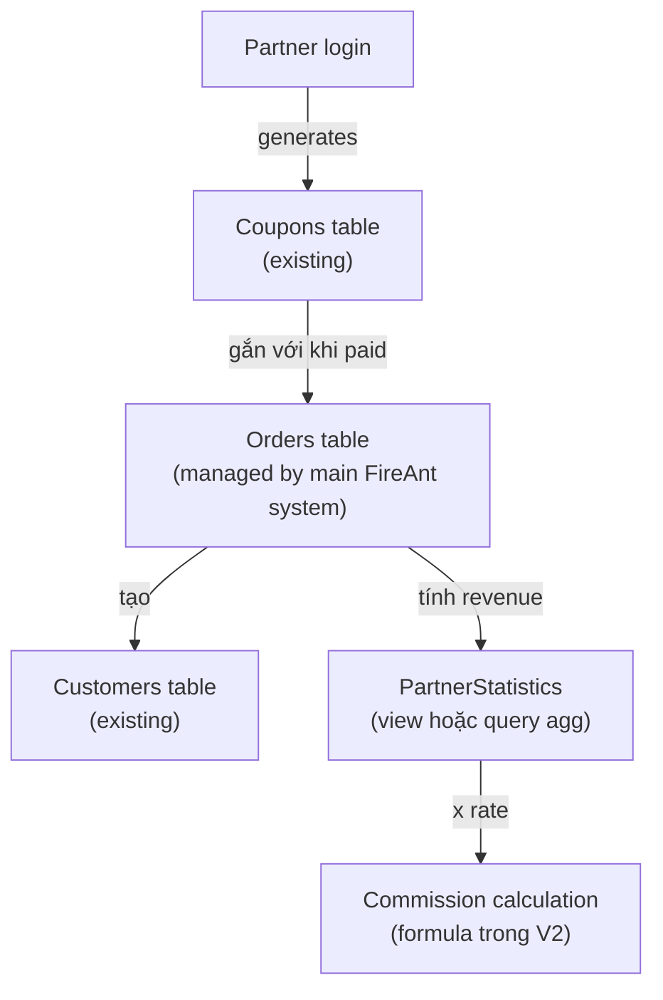
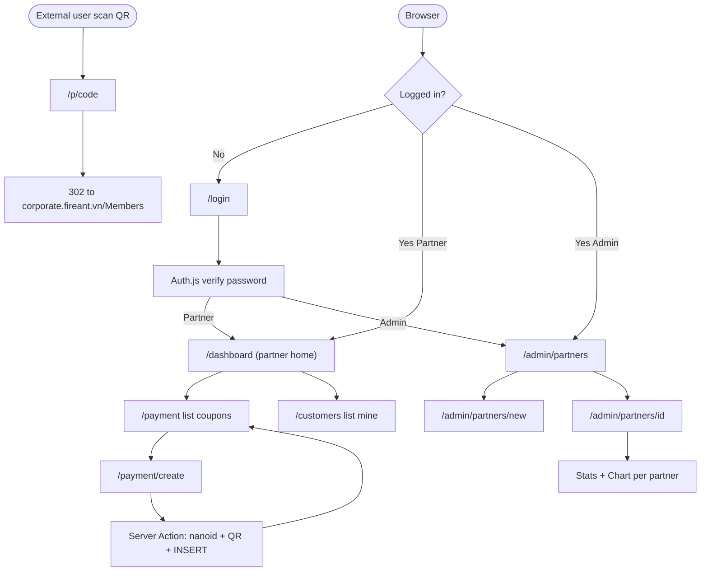

# MVP Partners Rewrite — Plan

## Mode

**SELECTIVE EXPANSION** — bạn cherry-pick thêm 3 module (Dashboard, Customer list, Admin panel) vào MVP. Vẫn giữ tinh thần "không vẽ vời", nhưng accept 3 module có giá trị product thật. Phase 2 vẫn defer những thứ khác.

## Hệ cũ — verdict

3 đèn đỏ buộc rewrite, không patch:

1. Firebase Dynamic Links chết từ 25/08/2025 — payment link đã hỏng ở prod >8 tháng. ([Utility.cs:213](C:/Projects/FireAnt_V2/FireAnt.Partners/Utils/Utility.cs))
2. Hardcoded API key Firebase trong source code.
3. CSRF validation tắt — [ApiAuthorizeAttribute.cs:47-50](C:/Projects/FireAnt_V2/FireAnt.Partners/Utils/ApiAuthorizeAttribute.cs).

Cộng AngularJS 1.x EOL từ 2021 → rotting. Rewrite hợp lý hơn patch.

## Quyết định kiến trúc đã chốt

1. **Greenfield rewrite**, không co-exist với MVC5
2. **Dùng chung DB chính FireAnt** (1 DB duy nhất, real-time, không sync)
3. **Big-bang cutover** khi sẵn sàng
4. **Self-host short-link + QR** (thay Firebase Dynamic Links)
5. **2 role**: Partner, Admin (không có PartnerAdmin như hệ cũ — cắt cho gọn)

## Scope MVP

### Module core (4 trang) — MUST có

1. `/login` — Đăng nhập (email + password)
2. `/payment/create` — Form tạo N coupon, sinh code + QR + payment link
3. `/payment` — List coupon của partner hiện tại (paginated)
4. `/p/[code]` — Short-link redirect đến `corporate.fireant.vn/Members?couponCode=<code>`

### Module cherry-pick (6 trang) — bạn vừa thêm

5. `/dashboard` — Stats card (Revenue/Customers/Commission) + 2 chart (Revenue 30d, Customers 30d) cho partner mình
6. `/customers` — List customer của partner mình (read-only, paginated, search)
7. `/admin/partners` — Admin: list tất cả partners + create button
8. `/admin/partners/[id]` — Admin: performance 1 partner cụ thể (stats + chart)
9. `/admin/partners/new` — Admin: form tạo partner mới (thay thế CLI script)
10. `/logout` — Logout (POST handler, không phải page)

### Cắt khỏi MVP (defer Phase 2)

- Click analytics short-link
- Email reset password tự service (admin reset tay qua DB hoặc UI admin)
- Email verification
- Migration data từ AspNetUsers cũ (admin tạo lại account khi cần)
- i18n, dark mode
- Customer detail page (chỉ list, không click vào)
- Bulk actions (xoá nhiều coupon, export Excel)
- Performance dashboard cross-partner cho admin (chỉ per-partner)

## Stack

```
Next.js 15 + TypeScript + App Router
Prisma 6 + SQL Server (DB chính FireAnt)
Auth.js v5 (Credentials provider) + bcrypt
Tailwind v4 + shadcn/ui (cherry-pick các component cần)
Recharts (2-3 chart, nhẹ hơn ECharts)
Sonner (toast notification, shadcn integrated)
Lucide React (icon)
nanoid + qrcode
Zod (validation form)
Deploy: Vercel hoặc self-host Node (đợi quyết định cuối khi build)
```

## Design system

**Phong cách**: Modern Enterprise — sạch sẽ, density vừa phải, không marketing flair, không gradient lòe loẹt. Dashboard finance-style (Linear / Vercel / Stripe Dashboard tham chiếu).

### Color tokens

```
background      — neutral-50 / neutral-950 (light/dark)
surface (card)  — white / neutral-900
border          — neutral-200 / neutral-800
text-primary    — neutral-950 / neutral-50
text-muted      — neutral-500 / neutral-400
accent          — blue-600 (primary action, links)
success         — emerald-600 (Đã nhận, IsPaid=true)
warning         — amber-600 (Sắp expire, expires < 3 ngày)
danger          — rose-600 (Expired, payment failed)
neutral-status  — neutral-400 (Pending, chưa redeem)
```

### Typography

- Display: Geist Sans (Vercel default) hoặc Inter
- Mono (code, coupon code): Geist Mono / JetBrains Mono
- KPI numbers (Revenue, Commission Thực nhận): tabular-nums, font-weight 600, size 36-48px

### Component library

shadcn/ui cherry-pick (install on-demand qua `npx shadcn add`):
- `button`, `input`, `label`, `card`, `table`, `dialog`, `dropdown-menu`
- `badge` (status indicator), `tabs`, `tooltip`, `toast` (Sonner)
- `pagination`, `skeleton` (loading states)

Không cài full shadcn — chỉ pull khi page cụ thể cần.

### Sidebar — Smart navigation

```
+-------------------------+
|  [Logo] FireAnt         |
|  Partners V2            |
+-------------------------+
|  PARTNER                |   <- section label, neutral-500 uppercase 11px
|  > Dashboard            |   <- icon + label, active state có bg-accent/10
|    Payment Links        |
|    Customers            |
|                         |
|  ADMIN  (chỉ admin thấy)|
|    Partners             |
|                         |
+-------------------------+
|  [Avatar] Tên user      |   <- bottom anchor
|  email@fireant.vn       |
|  [Logout]               |
+-------------------------+
```

- Active state: `bg-accent/10 text-accent border-l-2 border-accent`
- Hover: `bg-neutral-100 dark:bg-neutral-800`
- Collapsible trên mobile (drawer overlay)
- Section header chỉ hiện nếu user có role tương ứng

### Dashboard — Bento Grid layout

KPI section dùng **Bento Grid** (tile grid không đều, mix density):

```
+----------------------------------------------------------+
|  [Tile 1: HERO]                | [Tile 2]    | [Tile 3] |
|  Thực nhận tháng này           | Customers  | Links    |
|  ₫12,450,000                   | 47         | 152      |
|  +18% so với tháng trước       | mới        | đã tạo   |
|  (cao 2 cột, rộng 2 cột)       |            |          |
+--------------------------------+-------------+----------+
|                                | [Tile 4]    | [Tile 5] |
|                                | Đã thanh    | Sắp      |
|                                | toán  142   | hết hạn  |
|                                |             |  8       |
+--------------------------------+-------------+----------+
|  [Tile 6: chart wide]                                   |
|  Revenue 30 ngày qua (BarChart)                         |
+----------------------------------------------------------+
|  [Tile 7]                       | [Tile 8]              |
|  Customers 30 ngày (LineChart) | Top coupons (list)    |
+--------------------------------+--------------------------+
```

**Visual Hierarchy cho hoa hồng:**

- **Tile 1 (HERO — "Thực nhận")**: tile lớn nhất (col-span-2 row-span-2), số tiền hiển thị 48px tabular-nums font-semibold, label "Thực nhận tháng này" 14px text-muted bên trên, delta % màu emerald (tăng) / rose (giảm) bên dưới với arrow icon. Background subtle gradient hoặc plain white. Đây là **the one number partner mở dashboard để xem**.
- **Revenue (Tile khác)**: 24px, ngầm. Là input cho commission, không phải số chính.
- **Generated/Paid/Expiring**: 20px, secondary. Là context.

Logic: Partner mở dashboard để biết "tháng này tôi nhận được bao nhiêu". Revenue chỉ là context. Commission "Thực nhận" là job-to-be-done duy nhất.

### Bảng coupon — Status colors

Cột Status dùng `Badge` component với color semantic:

```
- "Đã thanh toán"   → emerald (IsPaid = true)
- "Đã sử dụng"      → blue (IsUsed = true, chưa paid)
- "Đang chờ"        → neutral (created, chưa paid chưa used)
- "Sắp hết hạn"     → amber (expires_at < 3 ngày)
- "Đã hết hạn"      → rose (expires_at < now, chưa paid)
```

Cột "Coupon code" dùng font-mono + Quick Copy button (icon clipboard) hover-reveal trên row.

### Payment Create — Tối giản

Single-column form, max-width 480px, center horizontal:

```
+---------------------------------------+
|  Tạo link thanh toán mới              |
|  Sinh N coupon kèm link + QR code     |
+---------------------------------------+
|  Số lượng *                           |
|  [____10____] (range 1-50)            |
|                                       |
|  Tiêu đề *                            |
|  [Gói Premium 1 tháng_____________]   |
|                                       |
|  Mô tả                                |
|  [Mô tả ngắn hiển thị khi user_____] |
|  [thanh toán______________________]   |
|                                       |
|  [    Tạo 10 link    ]                |
+---------------------------------------+
```

- Disable button khi quantity invalid
- Submit → Loading state (skeleton hoặc spinner trong button)
- Success → **Sonner toast** "Đã tạo 10 link thành công" + navigate `/payment` với highlight rows mới (background-flash 1.5s)

### Coupon list — Quick Copy + Preview

Mỗi row có 2 action button (icon-only, hover reveal):

- **Quick Copy** (icon `Copy`): click → copy `paymentLink` vào clipboard + toast "Đã copy". 1 click, không cần modal.
- **Preview** (icon `Eye`): click → mở `Dialog` (shadcn) hiển thị:
  - QR code lớn (256x256)
  - Payment link copy-able
  - Title + Description + Expire date
  - Status badge
  - Button "Download QR" (PNG)
  - Button "Copy link"
  - Button "Mở link" (test redirect)

```
+-----------------------------------------+
|  Coupon: x7Kp9aQ2          [emerald]   |
|  Đã thanh toán                          |
+-----------------------------------------+
|                                         |
|       [QR CODE 256x256]                |
|                                         |
|  https://partners.fireant.vn/p/x7Kp9aQ2|
|  [Copy link]                            |
|                                         |
|  Tiêu đề: Gói Premium 1 tháng          |
|  Hết hạn: 11/05/2026                    |
|                                         |
|  [Download QR]  [Mở link]   [Đóng]     |
+-----------------------------------------+
```

### Toast notification

Sonner top-right, auto dismiss 4s, success/error color coded:

- Tạo coupon thành công → success toast "Đã tạo {N} link thành công"
- Copy link → info toast "Đã copy vào clipboard"
- Tạo lỗi → error toast với message từ Server Action
- Login fail → error toast "Sai email hoặc mật khẩu"

Stack thay đổi vs plan cũ:
- Drizzle → **Prisma** (Drizzle SQL Server support đang preview, Prisma stable)
- Postgres Neon → **SQL Server hiện có** (DB chính FireAnt)
- Bỏ tạo schema mới — **introspect schema DB chính bằng `prisma db pull`**
- Thêm Recharts (cho Dashboard + Admin performance)

## Database — quan hệ

Dùng chung DB chính FireAnt (đã có sẵn các bảng). Mục tiêu: V2 đọc/ghi vào schema có sẵn, không tạo bảng mới (trừ trường hợp auth cần — xem mục Auth bridge bên dưới).



**V2 sẽ làm gì với schema có sẵn:**

- `Partners` table: SELECT (lookup theo userId login) — fields cần: `PartnerId`, `RevenueReference`, `UnderDiscountRate`, `AboveDiscountRate`
- `Coupons` table: SELECT (list) + INSERT (tạo mới). Fields: `PartnerId`, `Code` (mới — có thể cần ALTER TABLE thêm cột), `PaymentLink`, `QrPng` (mới — cần ALTER), `Title`, `Description`, `CreatedDate`, `ExpireDate`, `IsPaid`, `IsUsed`, `OrderId`
- `Customers` table: SELECT only (list customer theo `PartnerId`)
- `Orders` table: SELECT only (sum Total cho commission tính)

**Cần verify ở Step "db-introspect"** (trước khi code):
- Schema thật có khớp với inference từ code cũ không
- Có cột `QrPng`/`QrCode` chưa, hay phải `ALTER TABLE Coupons ADD QrPng NVARCHAR(MAX)`
- Code uniqueness — hiện tại code do `PartnersManager.GenerateCouponCode` sinh, có thể không phải nanoid format

## Auth bridge — quyết định khi build

DB chính có `AspNetUsers` (ASP.NET Identity, custom `SqlPasswordHasher`). 2 phương án, sẽ chốt khi đọc schema:

**Phương án A**: Reuse `AspNetUsers`. Hash adapter trong [lib/auth/legacy-hash.ts](lib/auth/legacy-hash.ts) verify legacy hash lần đầu, rehash bcrypt và lưu vào cột mới `PasswordHashV2`.

**Phương án B**: Tạo bảng riêng `PartnerV2Credentials (UserId, Email, PasswordHash, Role)`, không touch `AspNetUsers`. Admin tạo account mới qua CLI/UI. Đơn giản hơn nhưng nếu partner đang có account ở hệ cũ thì phải tạo lại.

**Default chọn B** (per quyết định trước "force reset password"). Override sau nếu introspect thấy schema phù hợp với A.

## Cấu trúc thư mục

```
fireant-partners-v2/
├── prisma/
│   ├── schema.prisma                          # Generated từ db pull, cleanup tay
│   └── migrations/                            # Chỉ migration của bảng riêng V2 nếu có
├── app/
│   ├── (auth)/
│   │   └── login/page.tsx
│   ├── (app)/                                 # Partner-only routes
│   │   ├── layout.tsx                         # Sidebar: Dashboard | Payment | Customers
│   │   ├── dashboard/
│   │   │   ├── page.tsx                       # Server: fetch stats
│   │   │   ├── stats-cards.tsx                # 3 KPI card
│   │   │   └── charts.tsx                     # Client: Recharts wrapper
│   │   ├── payment/
│   │   │   ├── page.tsx                       # List coupon
│   │   │   └── create/
│   │   │       ├── page.tsx
│   │   │       └── create-form.tsx
│   │   └── customers/page.tsx                 # List customer
│   ├── (admin)/
│   │   ├── layout.tsx                         # Sidebar admin: Partners
│   │   └── admin/
│   │       └── partners/
│   │           ├── page.tsx                   # List all partners
│   │           ├── new/page.tsx               # Form tạo partner mới
│   │           └── [id]/page.tsx              # Performance 1 partner
│   ├── p/[code]/route.ts                      # Redirect handler
│   ├── api/auth/[...nextauth]/route.ts
│   └── layout.tsx
├── lib/
│   ├── db.ts                                  # Prisma client singleton
│   ├── auth.ts                                # Auth.js config
│   ├── domain/
│   │   ├── coupons.ts                         # createCoupons, listCoupons, countByPartner
│   │   ├── customers.ts                       # listCustomers (by partnerId)
│   │   ├── partners.ts                        # listPartners (admin), getPartnerById
│   │   └── statistics.ts                      # getStats(partnerId, range) — Revenue/Customers/Commission
│   ├── shortlink.ts                           # nanoid + collision retry
│   ├── qr.ts                                  # qrcode wrapper
│   └── rbac.ts                                # requireRole('admin' | 'partner')
├── components/
│   ├── ui/                                    # shadcn cherry-pick
│   ├── layout/sidebar.tsx
│   ├── coupon-list.tsx
│   ├── stats-card.tsx
│   └── charts/
│       ├── revenue-chart.tsx                  # Recharts BarChart
│       └── customers-chart.tsx                # Recharts LineChart
├── scripts/
│   └── setup-account.ts                       # CLI tạo partner/admin
├── middleware.ts                              # Auth gate + role redirect
├── prisma.config.ts
├── .env.local                                 # DATABASE_URL (SQL Server), NEXTAUTH_SECRET, REDIRECT_BASE_URL
└── package.json
```

## Logic core

### Tạo coupon ([app/(app)/payment/create/create-form.tsx](app/(app)/payment/create/create-form.tsx))

Server Action:

```typescript
'use server';
import { z } from 'zod';
import { customAlphabet } from 'nanoid';
import QRCode from 'qrcode';

const Schema = z.object({
  title: z.string().min(1).max(200),
  description: z.string().max(500).optional(),
  quantity: z.number().int().min(1).max(50),
});

const nanoid = customAlphabet('abcdefghijkmnpqrstuvwxyz23456789', 8);

export async function createCoupons(input: unknown) {
  const session = await auth();
  if (!session) throw new Error('Unauthorized');
  const data = Schema.parse(input);

  const baseUrl = process.env.REDIRECT_BASE_URL!;
  const expiresAt = new Date(Date.now() + 14 * 24 * 3600 * 1000);
  const partnerId = session.user.partnerId;

  const rows = await Promise.all(
    Array.from({ length: data.quantity }, async () => {
      const code = nanoid();
      const paymentLink = `${baseUrl}/p/${code}`;
      const qrPng = await QRCode.toDataURL(paymentLink);
      return {
        partnerId,
        code,
        title: data.title,
        description: data.description ?? '',
        paymentLink,
        qrPng,
        createdDate: new Date(),
        expireDate: expiresAt,
        isPaid: false,
        isUsed: false,
      };
    })
  );
  await db.coupons.createMany({ data: rows });
  redirect('/payment');
}
```

### Stats query ([lib/domain/statistics.ts](lib/domain/statistics.ts))

```typescript
export async function getPartnerStats(partnerId: string, days = 30) {
  const since = new Date(Date.now() - days * 86400_000);
  const partner = await db.partners.findUnique({ where: { partnerId } });
  if (!partner) throw new Error('Partner not found');

  const coupons = await db.coupons.findMany({
    where: { partnerId, createdDate: { gte: since } },
    include: { order: { include: { customer: true } } },
  });

  const generatedLinks = coupons.length;
  const paidLinks = coupons.filter(c => c.isPaid).length;
  const customers = new Set(coupons.flatMap(c => c.order?.customer ? [c.order.customer.id] : [])).size;
  const revenue = coupons.reduce((s, c) => s + (c.order?.total ?? 0), 0);

  const commission = revenue <= partner.revenueReference
    ? revenue * partner.underDiscountRate
    : partner.revenueReference * partner.underDiscountRate
      + (revenue - partner.revenueReference) * partner.aboveDiscountRate;

  // bucket theo ngày cho chart
  const dailyBuckets = bucketByDate(coupons, days);

  return { generatedLinks, paidLinks, customers, revenue, commission, dailyBuckets };
}
```

Lưu ý: công thức commission (linear → tiered tại `RevenueReference`) là **inference từ code cũ** ([Views/Partners/Details.cshtml:76-107](C:/Projects/FireAnt_V2/FireAnt.Partners/Views/Partners/Details.cshtml)). Cần verify với business owner trước khi đưa lên prod, vì tính sai = sai tiền partner.

### Short-link redirect ([app/p/[code]/route.ts](app/p/[code]/route.ts))

```typescript
export async function GET(_: Request, { params }: { params: { code: string } }) {
  const coupon = await db.coupons.findUnique({ where: { code: params.code } });
  if (!coupon) return new Response('Not found', { status: 404 });
  return Response.redirect(`https://corporate.fireant.vn/Members?couponCode=${params.code}`, 302);
}
```

### RBAC middleware ([middleware.ts](middleware.ts))

```typescript
export async function middleware(req: NextRequest) {
  const token = await getToken({ req });
  if (!token) return NextResponse.redirect(new URL('/login', req.url));

  const path = req.nextUrl.pathname;
  if (path.startsWith('/admin') && token.role !== 'admin') {
    return NextResponse.redirect(new URL('/dashboard', req.url));
  }
  return NextResponse.next();
}
```

## User flow diagram



## Edge cases (MVP phải xử)

- Quantity ngoài 1-50 → Zod reject ở Server Action
- Code collision (rare với nanoid 8 chars from 32 alphabet ~10^12 combos) → unique constraint + retry 1 lần
- Short-link không tồn tại → 404 plain text
- Partner chưa login truy `/payment*`, `/dashboard`, `/customers` → redirect `/login`
- Partner truy `/admin/*` → redirect `/dashboard`
- Pagination empty state — show "Chưa có coupon nào, tạo mới ngay" + button
- Customers/Orders join return null (coupon chưa paid) → display "Chưa redeem"
- Stats range không có data → chart hiện flat 0, không crash

Không xử ở MVP (Phase 2):
- Reset password tự service
- Concurrent edit (admin sửa partner cùng lúc)
- Rate limit
- CSRF beyond Auth.js default (Auth.js đã handle)

## Implementation order (~15-20h CC time)

1. **Init project** — Next.js + Tailwind + Prisma + Auth.js + Recharts (~30 phút)
2. **DB introspect + verify** — `prisma db pull` từ SQL Server, verify Coupons có cột `Code` và `QrPng` không, ALTER nếu thiếu (~1h)
3. **Auth flow** — `/login`, Auth.js Credentials, RBAC middleware (~2h)
4. **Setup-account CLI** — script tạo partner/admin từ command line (~30 phút)
5. **Tạo coupon flow** — form + Server Action + nanoid + qrcode (~2h)
6. **List coupon** — table + pagination + copy + QR preview (~1.5h)
7. **Short-link redirect** — `/p/[code]` (~30 phút)
8. **Dashboard partner** — stats card + Recharts revenue chart + customers chart (~2.5h)
9. **Customer list** — query + table + search + paginate (~1.5h)
10. **Admin partners list + create** — list + form tạo mới (~1.5h)
11. **Admin partner detail performance** — reuse dashboard component cho partner cụ thể (~1.5h)
12. **Deploy + smoke test** — env vars, test partner + admin flow (~1.5h)

## NOT in scope (explicit defer)

- Click analytics short-link → Phase 2
- Reset password UI tự service → Phase 1.5
- Customer detail page → Phase 2
- Bulk actions, export Excel → Phase 2
- Cross-partner performance dashboard cho admin → Phase 2
- Migration data AspNetUsers cũ → admin tạo lại tay
- i18n, dark mode → Phase 2
- Email notification (coupon được redeem, payment success) → Phase 2

## Pre-build checklist (cần biết trước khi switch agent mode)

1. **Workspace path** để tạo project — VD `C:\Projects\FireAnt.Partners.V2`
2. **DATABASE_URL** SQL Server chính (read-write access). Bạn cần cung cấp connection string
3. **REDIRECT_BASE_URL** cho short-link — VD `https://partners.fireant.vn` (production) hoặc `http://localhost:3000` (dev)
4. **Auth bridge phương án** — A (reuse AspNetUsers + hash adapter) hoặc B (bảng riêng) — sẽ quyết sau khi introspect schema
5. **Verify công thức commission** với business owner trước khi ship — quan trọng vì sai = sai tiền partner

## Risk lớn nhất cần ý thức

**Sai số commission**. Logic 2 bậc (`UnderDiscountRate` và `AboveDiscountRate` tại ngưỡng `RevenueReference`) là inference từ Razor view cũ, không phải spec chính thức. View đã comment ra phần `AboveDiscountRate` → có thể chưa dùng, có thể đã đổi. **Phải verify với business owner trước cutover**. Nếu không có spec rõ, MVP nên hiển thị stats nhưng **không show "Commission" cho partner cho đến khi spec confirm** — hiển thị placeholder "Đang tính" hoặc ẩn cột.

## GSTACK REVIEW REPORT

| Review | Trigger | Why | Runs | Status | Findings |
|--------|---------|-----|------|--------|----------|
| CEO Review | `/plan-ceo-review` | Scope & strategy | 1 | CLEAR | Mode SELECTIVE EXPANSION, 3 module cherry-pick (dashboard/customers/admin), 2 đèn đỏ phải fix (commission spec, QrPng column) |
| Codex Review | `/codex review` | Independent 2nd opinion | 0 | — | — |
| Eng Review | `/plan-eng-review` | Architecture & tests (required) | 0 | — | — |
| Design Review | `/plan-design-review` | UI/UX gaps | 0 | — | — |

**UNRESOLVED:** 2 (auth bridge phương án, công thức commission verify)

**VERDICT:** CEO REVIEW DONE — recommend `/plan-eng-review` next để lock kiến trúc trước khi build. Đặc biệt cần review: (1) commission calculation formula correctness, (2) DB sharing concerns (V2 INSERT vào table đang được ASP.NET MVC quản lý), (3) auth bridge approach.
